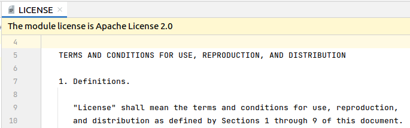
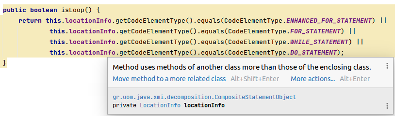
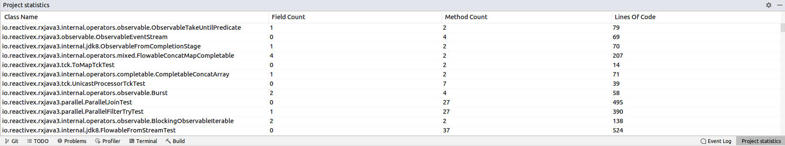

# Refactoring Workshop Demo

The project aims to demonstrate how the IntelliJ Platform could be useful for researchers in several use cases.

To learn more, explore
the [IntelliJ Platform SDK documentation](https://plugins.jetbrains.com/docs/intellij/welcome.html) and check out code
samples in the [IntelliJ Platform SDK Code Samples repository](https://github.com/JetBrains/intellij-sdk-code-samples).

## How to install

The plugin requires Java 17 and IntelliJ IDEA of version 2022.3.3 or higher to work.

To install the plugin:

1. Open IntelliJ IDEA and go to `File`/`Settings`/`Plugins`
2. Select the gear icon, and choose `Install Plugin from Disk...`
3. Choose the ZIP archive `demo-plugin-1.0.zip`
4. Click `Apply`
5. Restart the IDE

To build the plugin manually, run the following command:

`./gradlew :demo-plugin:buildPlugin`

## Running in CLI

The plugin may also be used in CLI to extract JavaDoc and KotlinDocs comments from the project (see `Mining data` example for details).

Open the terminal and execute the following commands:

`cd /refactoring-workshop-demo/`

`./runDemoPluginCLI.sh <absolute path to the project> <absolute path to the output directory>`

## Use cases

| Use case                   | Description                                                                                                       | Implementation package
| :--------------------------|:------------------------------------------------------------------------------------------------------------------| :----------------------------------------------------------------------------------|
| Mining data                | Headless plugin that extracts all methods and the corresponding JavaDoc and KotlinDocs comments from the project. | `demo-cli/demo.plugin`
| Running ML models          | Running ML model inside the plugin.                                                                               | `demo-plugin/demo.plugin.modelInference`
| Recommending refactorings  | An inspection that detects the Feature Envy code smell and recommends Move Method refactoring.                    | `demo-plugin/demo.plugin.featureEnvy`
| Visualizing information    | A tool window that shows some statistics about the project.                                                       | `demo-plugin/demo.plugin.statistics`

## How to use

### Mining data

The plugin runs in the headless mode, meaning that it does not launch the UI of the IDE, working in the background.
The plugin receives two parameters: a path to the project that needs to be parsed and a path to the output file.
Then, the plugin launches IntelliJ IDEA in the background, detects all Java and Kotlin files in the given project, and extracts each method name and corresponding JavaDoc and KotlinDoc.
Finally, the plugin saves the extracted information in the JSON format.

To start the mining JavaDoc and KotlinDocs comments, open terminal and execute the following commands:

`cd /refactoring-workshop-demo/`

`./runDemoPluginCLI.sh <absolute path to the project> <absolute path to the output file>`

This template can be easily modified to collect almost any code entity by changing the analyzed PSI nodes.

### Running ML models

To see how the plugin works, open any project in IntelliJ IDEA and go to the license file. The ML classifier processes the text of the license and tries to recognize it.
The plugin supports the following three licenses: `Apache-2.0`, `MIT`, and `BSD-3-Clause`.
Then, the plugin will show a tiny message at the top of the editor with the name of the detected license.

The source code of this use case can be used to understand how to inference an ONNX model in your tool.

### Recommending refactorings

The  plugin analyzes the currently opened file, detects the Feature Envy code smell and suggests the user to perform a Move Method refactoring and move such a method to the more appropriate class.

This template can be the foundation for almost any plugin that targets refactorings, since it showcases how to use the IntelliJ Platform's APIs to automatically carry out refactorings without writing everything manually.

### Visualizing information

The plugin extracts all Kotlin and Java classes, analyzes PSI to calculate several basic metrics: number of fields, number of methods, and lines of code.
Then, the plugin shows the results in the `Projects Statistics` tool window that is located in the bottom right corner of the IDE.

This use case introduces such a basic and important UI element as the tool window, which can be used in almost any plugin to display the relevant information.

## Contacts

If you have any questions about the use cases, feel free to contact us
using [GitHub issues](https://github.com/JetBrains-Research/refactoring-workshop-demo/issues).
